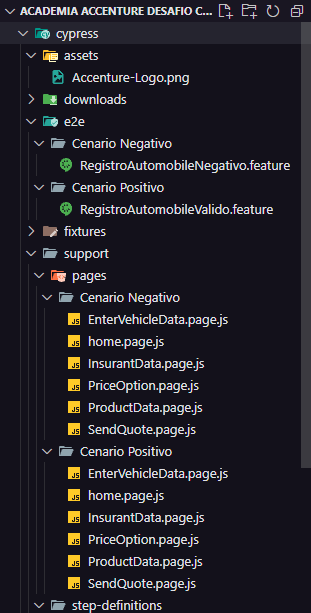

# Academia QE - Desafio Cypress 2025

Este projeto foi desenvolvido como parte do desafio da Academia QE 2025, com o objetivo de automatizar testes end-to-end utilizando [Cypress](https://www.cypress.io/).

## 📋 Índice

- [Sobre o Projeto](#sobre-o-projeto)
- [Tecnologias Utilizadas](#tecnologias-utilizadas)
- [Instalação](#instalação)
- [Como Executar os Testes](#como-executar-os-testes)
- [Estrutura de Pastas](#estrutura-de-pastas)
- [Comandos Personalizados](#comandos-personalizados)
- [Considerações Finais](#considerações-finais)
- [Autor](#autor)

## Sobre o Projeto

O projeto consiste na automação de testes para validar o comportamento de uma aplicação web de seguros. Os testes cobrem fluxos como preenchimento de formulários, seleção de opções e validação de submissões.

## Tecnologias Utilizadas

- [Cypress](https://www.cypress.io/): Framework de testes end-to-end.
- [Faker.js](https://fakerjs.dev/): Biblioteca para geração de dados fictícios.
- [Lodash](https://lodash.com/): Biblioteca utilitária para manipulação de dados.

## Ferramenta de pesquisa

- [Cypress](https://docs.cypress.io/app/get-started/why-cypress): Pagina de Documentação do Framework.

## Instalação

Para instalar e configurar o projeto localmente, siga os passos abaixo:

1. **Clone o repositório:**

   ```bash
   git clone https://github.com/arthurbrito22/Academia-QE-Desafio-Cypress-2025.git
   ```

2. **Navegue até o diretório do projeto:**

   ```bash
   cd Academia-QE-Desafio-Cypress-2025
   ```

3. **Instale as dependências:**

   ```bash
   npm install
   ```

## Como Executar os Testes

Para executar os testes, utilize um dos comandos abaixo:

- **Executar com interface gráfica:**

  ```bash
  npx cypress open
  ```

  Este comando abrirá o Cypress Test Runner, permitindo a execução interativa dos testes.

- **Executar em modo headless:**

  ```bash
  npx cypress run
  ```

  Este comando executará todos os testes em segundo plano, sem abrir a interface gráfica.

## Estrutura de Pastas

A estrutura principal do projeto é a seguinte:



## Comandos Personalizados

No arquivo `cypress/step-definitions/e2e.js`, foram definidos imports para facilitar a navegação da automação dos testes.


## Considerações Finais

Este projeto demonstra a eficácia do uso combinado do Cypress com bibliotecas como Faker.js e Lodash para a automação de testes end-to-end. A geração dinâmica de dados permite a simulação de diversos cenários, aumentando a cobertura e a confiabilidade dos testes.

## Autor

Desenvolvido por [Arthur Brito](https://github.com/arthurbrito22) como parte do desafio da Academia QE 2025.
